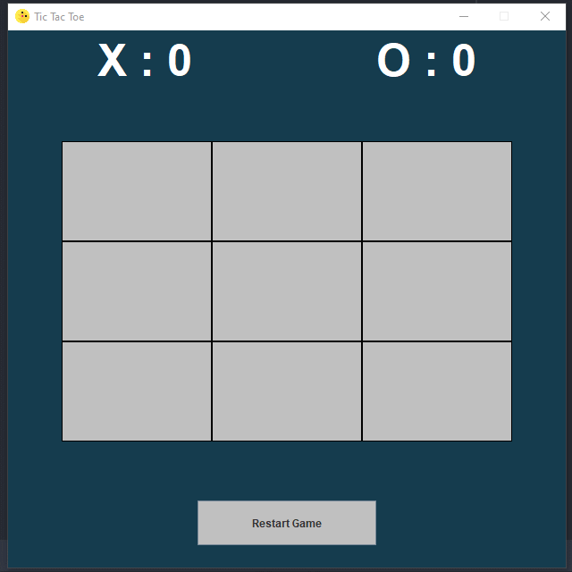

<h1 align="center">❌Tic Tac Toe⭕</h1>

## 📕 About

A Simple project from Game Tic Tac Toe in Java with library Swing.

## ❔ How to use

```
# Clone Git Repository
$ git clone https://github.com/YoruHinda/Tic-Tac-Toe.git
```

```
# Enter Directory
$ cd tictactoe
```

```
# Run Application
$ java -jar tictactoe.jar
```

## 📃 License

This project is under the MIT License. See the file LICENSE for more details.